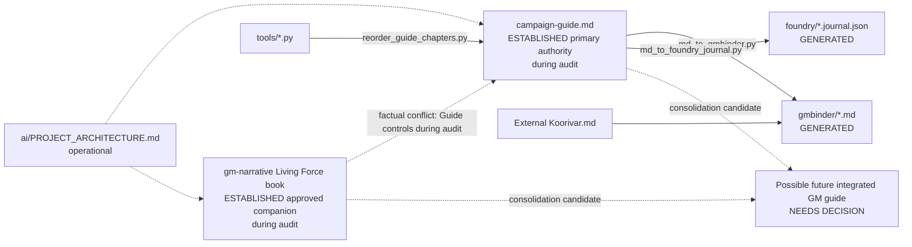

# Rules, Skills, and Full Project Audit — Implementation Plan

**Status:** Planning draft (revised 2026-08-26 — integrated-guide feasibility). **Not approved.** Implementation **NOT AUTHORIZED**.  
**Authority:** Kakeman89  

**Supersession:** The prior version of this plan currently exists on disk. This revised version supersedes that planning draft once saved. No phase may execute from the superseded version.

**Strategic note:** Kakeman89 is considering replacing the current primary-guide-plus-narrative-companion arrangement with **one authoritative, integrated GM campaign guide** organized Act → Session → Scene for point-of-use play. The audit must **evaluate** that possibility and supply evidence for a later, separate migration plan. The audit must **not** merge, retire, archive, or rewrite either manuscript.

---

## 1. Executive summary

Dawn of the Jedaii currently has:

- **Established primary authority (during audit):** [`dawn-of-the-jedaii-campaign-guide.md`](../../dawn-of-the-jedaii-campaign-guide.md)
- **Established approved companion (during audit):** [`gm-narrative/dawn-of-the-jedaii-living-force-gm-book.md`](../../gm-narrative/dawn-of-the-jedaii-living-force-gm-book.md)
- **Generated outputs:** [`gmbinder/`](../../gmbinder/), [`foundry/dawn-of-the-jedaii.journal.json`](../../foundry/dawn-of-the-jedaii.journal.json)
- **Untracked draft AI config:** [`.cursor/rules/`](../../.cursor/rules/), [`.cursor/skills/`](../../.cursor/skills/) (paths often assume absent `state/`, `sources/`, etc.)

**NEEDS DECISION:** The audit will determine the content, tooling, continuity, usability, and migration implications of consolidating the two manuscripts into one integrated authoritative GM guide.

During the audit, the current architecture is:

- the **established** architecture that must be **preserved while auditing**
- **not necessarily** the desired permanent architecture
- a **candidate** for controlled consolidation **after** the audit

Do **not** assume permanent separation. Do **not** assume consolidation is approved. Do **not** perform consolidation in this audit.

**Recommended approach:** **EXTEND** existing rules/skills to match verified paths; **ADD** generated-output protection, architecture audit, extended guide critique (incl. point-of-use / crosswalk), output sync, audit synthesis; **MIGRATE** Legends+provenance into `legends-source-audit`; **DEFER** authoritative structured `state/`, generated-file notices tooling, and **`integrated-guide-migration`** skill; run a gated multi-session audit that never auto-corrects approved content.

**Ops trees** (`ai/`, `.cursor/`, `reports/`) are operational, not campaign canon, and must not silently override primary campaign authority during the audit period.

**After Phase 10 only (if Kakeman89 chooses):** a separate **Integrated GM Guide Migration Plan** may be created. **No migration phase is part of this audit plan.**

**This plan file path:** [`ai/plans/2026-08-26-rules-skills-and-project-audit.md`](2026-08-26-rules-skills-and-project-audit.md)  
**Future permanent architecture doc (not created by this revision):** [`ai/PROJECT_ARCHITECTURE.md`](../PROJECT_ARCHITECTURE.md) — **ADD** when Phase 1 authorized.  
**Future audit outputs:** `reports/audits/` — **ADD** when Phase 4+ authorized.

Files under `ai/`, `.cursor/`, and `reports/` are **operational** (instructions, plans, configuration, findings). They are **not** campaign canon and must not silently override the primary campaign authority. Audit findings and recommendations do not become approved campaign material without explicit Kakeman89 authorization.

---

## 2. Verified repository state

| Item | Evidence |
|------|----------|
| Branch | `main` |
| HEAD | `6ac41f4d3450c0bc18c133fba2d29c0b37a1aff4` — *Deepen Living Force GM book for Arcs III and IV.* |
| Remote | `origin` → `https://github.com/unrealkakeman89/dawn-of-the-jedaii.git` |
| Sync | `main...origin/main` (no ahead/behind reported at planning time) |
| Uncommitted (at planning inspection) | Untracked `.cursor/` (5 rules + 4 skills); this plan under `ai/plans/` |
| AGENTS.md | **None** |
| Hooks / MCP / commands | **None** found |
| `docs/`, `.github/` | **Missing** |
| `ai/PROJECT_ARCHITECTURE.md` | **Not created** (proposed only) |
| Python dep | `markdown>=3.5` in [`requirements.txt`](../../requirements.txt) |

**Top-level content areas:** `.cursor/`, `ai/`, `foundry/`, `gm-narrative/`, `gmbinder/`, `tools/`, `.gitignore`, `dawn-of-the-jedaii-campaign-guide.md`, `README.md`, `requirements.txt`

**Protect uncommitted work:** Any future implementation that touches `.cursor/` must treat the current untracked drafts as the starting baseline; do not delete them without Kakeman89 authorization.

---

## 3. Existing planning and documentation convention

**Label: ADD**

| Kind | Path | Role | Canon? |
|------|------|------|--------|
| Dated plans | `ai/plans/YYYY-MM-DD-<slug>.md` | Audit / implementation planning | **No** — operational |
| Permanent architecture | `ai/PROJECT_ARCHITECTURE.md` | Current SoT matrix, edit/gen boundaries, tool I/O, authority hierarchy; must note consolidation as **NEEDS DECISION** | **No** — operational |
| Audit outputs | `reports/audits/` | Manifest, critique, findings register, content crosswalk | **No** — operational evidence |
| Continuity / source working reports | `reports/continuity/`, `reports/source-audits/` | Skill working reports (create on first authorized use) | **No** — operational |
| Future migration plan | `ai/plans/YYYY-MM-DD-integrated-gm-guide-migration.md` (example) | **Only after Phase 10 if authorized** | **No** — operational |
| Cursor rules / skills | `.cursor/rules/`, `.cursor/skills/` | Agent configuration | **No** — operational |

Campaign canon during the audit remains in approved campaign prose (primary guide, and companion presentation where not in factual conflict).

---

## 4. Preliminary architecture findings

**During-audit posture:** Preserve both manuscripts and the current factual-conflict rule (guide controls unless Kakeman89 approved companion supersession). Differences in voice, detail, organization, or emphasis are **not** automatic continuity defects.

Do **not** state that the primary-guide-plus-companion model must be permanently retained. Do **not** state that the two manuscripts must be merged. Consolidation remains **NEEDS DECISION**.

**Confirmed technical risks (planning observations only — not audit findings counts):**

1. **Generated outputs lack generated-file notices** — deferred tooling improvement; do not add during the rules phase unless separately authorized.
2. **`md_to_foundry_journal.py` uses `secrets.choice` for page `_id`s** — regeneration appears **not ID-stable**. **Priority technical audit item:** whether regen assigns new IDs; whether Foundry import updates vs duplicates; whether links/permissions depend on IDs; whether deterministic IDs should derive from stable chapter identifiers. **No tooling correction is authorized by this plan.**
3. **`md_to_gmbinder.py` hardcodes an absolute OneDrive path** to an external Koorivar species file — review under four axes (portability, provenance/licensing, missing-dependency behavior, guide vs GMB divergence). **Do not assume vendoring.**
4. **`reorder_guide_chapters.py` writes the master guide in place** — treat as dangerous write tooling.
5. **Draft rules/skills assume structured `state/` and `sources/` that do not exist** — current campaign facts live as approved prose in the primary guide (plus companion presentation and Appendix D classifications). Authoritative structured state remains **DEFER**red.

---

## 5. Preliminary source-of-truth matrix (established during audit)

| Path | Role during audit | Edit during audit? | Produced by | Label |
|------|-------------------|--------------------|-------------|-------|
| `dawn-of-the-jedaii-campaign-guide.md` | Established primary authority for facts, chronology, structure, approved decisions; Foundry/GMB generation source | Preserve; no silent rewrite | Manual (+ historical reorder script) | **KEEP** during audit |
| `gm-narrative/*.md` | Established approved companion — narrative, atmosphere, interpretation, GM guidance | Preserve; no merge/retire | Manual | **KEEP** during audit |
| `gmbinder/*.md` | Publication output | **Never direct** (regen) | `tools/md_to_gmbinder.py` | **KEEP** as generated |
| `foundry/*.journal.json` | Foundry import output | **Never direct** (regen) | `tools/md_to_foundry_journal.py` | **KEEP** as generated |
| `foundry/README.md`, root `README.md`, `gm-narrative/README.md` | Ops docs | Direct | Manual | **KEEP** |
| `tools/*.py` | Build / migration | Direct (code only) | Manual | **KEEP** |
| `ai/PROJECT_ARCHITECTURE.md` | Operational architecture (proposed) | Direct when Phase 1 authorized | Manual | **ADD** |
| `ai/plans/**` | Dated plans | Direct when authorized | Manual | **ADD** |
| `.cursor/rules/*`, `.cursor/skills/*` | AI governance (draft, untracked) | Direct when authorized | Manual | **EXTEND** / **MIGRATE** |
| `reports/audits/integrated-guide-content-crosswalk.yaml` | Crosswalk evidence | When Phase 4+ authorized | Manual / skills | **ADD** |
| `reports/**` | Findings and audit artifacts (proposed) | Direct when authorized | Manual / skills | **ADD** |
| `sources/`, `state/`, `guide/`, `design/`, `templates/` | Referenced by drafts; **absent** | N/A | N/A | **DEFER** (do not invent as authority over prose) |

**Authority hierarchy during audit (campaign content):**

1. Explicit Kakeman89 decisions
2. Primary campaign guide (`dawn-of-the-jedaii-campaign-guide.md`)
3. Approved companion where it does not factually conflict; companion may expand presentation without becoming primary fact authority
4. Repository-designated sources (Appendix D where it covers a claim; future `sources/` only if authorized)
5. Verified Star Wars Legends continuity
6. Clearly labeled campaign adaptation / original campaign material

**Factual conflict rule during audit:** When the companion and primary guide conflict on facts, the **primary guide controls**, unless Kakeman89 explicitly approved the companion version as superseding.

**NEEDS DECISION (post-audit):** Whether authority transitions to a single integrated guide; when; what happens to the companion (including possible archival — **not** pre-approved).

**Bidirectional sync today:** None automated. Manual risks: editing GMB/Foundry as if sources; updating companion facts without updating the primary guide.

**Phase 1 prerequisite (when authorized):** Write the maintained matrix into `ai/PROJECT_ARCHITECTURE.md`. Residual inspections before Gate 1 closes:

- Diff-sample guide H1 bodies vs matching GMB chapters vs Foundry page `text.markdown` for staleness
- Review GMB Ch22 / external Koorivar inject vs primary guide Ch12 under the four axes
- Confirm `reorder_guide_chapters.py` is historical-only vs still needed
- Inventory intentional presentation overlap between guide arcs and Living Force book §§4–8 (not automatic defects)
- Record consolidation as **NEEDS DECISION**, not as approved direction

### Appendix D handling (refined)

- Use **Appendix D** as the current provenance and classification authority **where it covers a claim**.
- **Absence from Appendix D does not itself prove** a claim is unsupported.
- Before assigning `NEEDS_SOURCE`, **search the remaining approved repository content** (primary guide chapters, companion, READMEs, and any Kakeman89-approved notes).
- Only after that search fails (or conflicts remain unresolved) classify `NEEDS_SOURCE` or `CONTINUITY_CONFLICT` as appropriate.

### Structured-state deferral (refined)

- **Authoritative** structured campaign state remains **DEFER**red.
- The audit **may** record normalized factual observations in the findings register.
- Those observations are **evidence only**.
- They do **not** become authoritative state.
- **No audit artifact** (manifest, register, critique, continuity report, crosswalk) supersedes approved prose.

### Proposed future design principle (test, do not enforce)

**Local Completeness Principle:** A runnable scene chapter should contain all information required to understand, prepare, and adjudicate that scene, except universally reused mechanics, full-length reference entries, or material whose controlled separation serves a clear purpose.

The audit must **test** whether this principle fits the existing campaign. It must **not** rewrite chapters to enforce it.

---

## 6. Protected architecture (during this audit)

Until Kakeman89 authorizes otherwise:

- **Do not** reorganize top-level directories
- **Do not** merge, move, rename, archive, or delete either manuscript
- **Do not** delete or overwrite campaign prose to “fix” lore
- **Do not** treat audit recommendations as edit or migration authorization
- **Do not** edit `gmbinder/` or `foundry/*.journal.json` as sources
- **Do not** run write-capable tools (`md_to_*`, `reorder_*`) during audit sessions without explicit regen authorization
- **Do not** invent `state/` YAML and declare it authoritative over existing approved guide text
- **Do not** let `ai/`, `.cursor/`, or `reports/` silently override the primary campaign authority
- Preserve Appendix D deliberate ambiguities and intentional compression / `[T]` table fiction
- Preserve companion voice/detail/organization differences that are not factual conflicts
- Consolidation findings are **proposals** for a later migration plan only

---

## 7. Existing rules and skills

### Rules (untracked under `.cursor/rules/`)

| File | Activation | Status vs need | Label |
|------|------------|----------------|-------|
| `dawn-of-the-jedaii-project-governance.mdc` | alwaysApply | Strong baseline; needs non-canon ops trees, audit≠rewrite, consolidation≠approval, architecture-doc pointer | **EXTEND** |
| `10-legends-continuity.mdc` | alwaysApply | Matches required classifications and authority order | **KEEP** (minor **EXTEND** if needed) |
| `source-and-canon-control.mdc` | agent-requestable | References missing `sources/source-index.yaml`; must align with Appendix D refined handling | **EXTEND** |
| `original-house-voice.mdc` | agent-requestable | Matches prose goal; no named-author imitation | **KEEP** |
| `campaign-state-integrity.mdc` | globs `guide/**`, `state/**` | **Wrong globs**; must not imply `state/` already exists | **EXTEND** (retarget globs; defer authoritative state writes) |

### Skills (untracked; all `disable-model-invocation: true`)

| Skill | Gap | Label |
|-------|-----|-------|
| `legends-lore-verification` | Solid core; merge provenance into renamed skill | **MIGRATE** → `legends-source-audit` |
| `continuity-auditor` | Solid checklist; needs finding taxonomy + paths | **EXTEND** |
| `campaign-state-watcher` | Assumes absent `state/`; retain draft as **DEFERRED** | **DEFER** (not among Phase 3 seven; see §9) |
| `adventure-architect` | Assumes missing `design/` + `templates/`; **authoring only** | **EXTEND** |

**Missing vs audit needs:** architecture auditor, combined Legends+provenance auditor, output-sync validator, GM-guide/usability critique (report-only, point-of-use, crosswalk), final audit synthesis, shared finding schema. **REJECT** creating fifteen micro-skills. **REJECT** a separate `source-and-provenance-audit` skill unless pilot evidence later proves the workflows cannot share one procedure.

---

## 8. Proposed rules (minimum set)

Prefer **six** persistent rules (five existing + one new), not eleven.

### R1 — Project governance — **EXTEND**

- **Path:** [`.cursor/rules/dawn-of-the-jedaii-project-governance.mdc`](../../.cursor/rules/dawn-of-the-jedaii-project-governance.mdc)
- **Activation:** `alwaysApply: true`
- **Enforces:**
  - inspect-first; no destructive ops without auth; planning ≠ implementation
  - audit findings and recommendations are **proposals**, not approved campaign material
  - audit may evaluate consolidation but findings ≠ approval to merge/retire manuscripts
  - files under `ai/`, `.cursor/`, and `reports/` are operational and **not campaign canon**; they must not silently override the primary campaign authority
  - preserve placeholders; Kakeman89 attribution; report every file touch
  - no hardcoded LLM model requirements (manual selection of a strong reasoning model allowed for consequential tasks only)
  - point agents at `ai/PROJECT_ARCHITECTURE.md` once it exists
- **Required before audit:** Yes
- **Validation:** Rule loads; no “auto-fix” language; non-canon ops trees stated; consolidation not treated as approved
- **Rollback:** Restore prior `.mdc` from working copy / git when tracked

### R2 — Legends continuity — **KEEP / light EXTEND**

- **Path:** [`.cursor/rules/10-legends-continuity.mdc`](../../.cursor/rules/10-legends-continuity.mdc)
- **Activation:** `alwaysApply: true`
- **Enforces:** authority order; Disney ban; shared-name non-interchangeability; classifications `LEGENDS_VERIFIED` | `CAMPAIGN_APPROVED` | `CAMPAIGN_ADAPTATION` | `ORIGINAL_CAMPAIGN_MATERIAL` | `NEEDS_SOURCE` | `CONTINUITY_CONFLICT`; report conflicts, don’t rewrite approved campaign material
- **Required before audit:** Yes

### R3 — Source authority and provenance — **EXTEND**

- **Path:** [`.cursor/rules/source-and-canon-control.mdc`](../../.cursor/rules/source-and-canon-control.mdc)
- **Activation:** agent-requestable (lore/mechanics)
- **Enforces:**
  - primary guide + Appendix D (where covering) + approved companion (non-conflicting presentation) as designated repository sources until a formal sources index exists
  - Appendix D absence ≠ automatic unsupported; search remaining approved content before `NEEDS_SOURCE`
  - no fabricated citations; paraphrase copyrighted text
  - record contradictions under `reports/source-audits/` when that directory is authorized
- **Conflict risk:** Must not outrank Kakeman89 decisions or R2; must not treat ops trees as lore sources
- **Required before audit:** Yes

### R4 — Original house voice — **KEEP**

- **Path:** [`.cursor/rules/original-house-voice.mdc`](../../.cursor/rules/original-house-voice.mdc)
- **Activation:** agent-requestable
- **Required before audit:** Recommended for prose domain; not blocking for architecture pilot

### R5 — Campaign continuity + GM/player separation — **EXTEND**

- **Path:** [`.cursor/rules/campaign-state-integrity.mdc`](../../.cursor/rules/campaign-state-integrity.mdc)
- **Activation:** globs retargeted to:
  - `dawn-of-the-jedaii-campaign-guide.md`
  - `gm-narrative/**/*.md`
  - `reports/continuity/**` (when present)
- **Must not** glob non-existent `guide/` or `state/` as if present
- **Enforces:** continuity checks before content changes; knowledge boundaries; spoiler policy from guide Ch00; companion presentation differences ≠ automatic defects; mysteries ≠ contradictions; prose does not silently override primary-guide facts; audit observations are not authoritative state
- **Required before audit:** Yes (after glob fix)

### R6 — Generated outputs + pipeline protection — **ADD**

- **Path:** `.cursor/rules/generated-output-protection.mdc` (proposed)
- **Activation:** globs `gmbinder/**`, `foundry/**/*.json`, `tools/**/*.py`
- **Enforces:**
  - never hand-edit generated publication/Foundry JSON as SoT
  - edit primary guide then regenerate when authorized
  - treat `reorder_guide_chapters.py` as dangerous
  - do not execute write scripts during audit
  - flag non-deterministic Foundry IDs as a known risk / priority audit topic
  - do not mutate live Foundry worlds from the agent
  - generated-file notices are a **deferred tooling** concern: do **not** implement notices during the rules phase unless separately authorized
- **Required before audit:** Yes

### Explicitly **REJECT** / **DEFER** as separate always-on rules

- Adventure-guide structure → skill + optional short section in R5 (**DEFER** standalone)
- Change-reporting/validation → fold into R1 (**REJECT** duplicate)
- Model selection → short note in R1 only; never hardcode model names (**ADD** sentence, not a rule file)

---

## 9. Proposed skills

### Phase 3 skill count clarification

Phase 3 will create or revise **seven active audit/authoring skills**.

The existing `campaign-state-watcher` draft will be **retained** but classified as **DEFERRED**. It is **not** counted among the seven active Phase 3 skills. It must **not** be invoked during the audit, deleted, or expanded into authoritative state writing unless separately authorized.

### Phase 3 required set: **seven** active skills

| # | Skill | Label | Role |
|---|-------|-------|------|
| S1 | `repository-architecture-audit` | **ADD** | Current SoT / tool I/O; document consolidation as **NEEDS DECISION** |
| S2 | `legends-source-audit` | **MIGRATE** | Legends + provenance (no separate provenance skill) |
| S3 | `continuity-auditor` | **EXTEND** | Internal continuity; factual conflicts between manuscripts |
| S4 | `adventure-architect` | **EXTEND** | **Authoring only** when creation/revision authorized |
| S5 | `adventure-and-guide-critique` | **ADD** | **Report-only**; point-of-use; crosswalk entries; domains E–L + **P** |
| S6 | `output-sync-validator` | **ADD** | GMB/Foundry/sync; ID stability; gen dependencies under consolidation analysis |
| S7 | `final-audit-synthesis` | **ADD** | Master critique + **Integrated Guide Recommendation** |

**DEFERRED (retained draft; not among the seven):** `campaign-state-watcher` — retain; do not invoke during audit; do not delete; do not expand into authoritative state writing unless separately authorized.

### Boundary: authoring vs critique vs migration

- `adventure-architect` (**S4**) is an **authoring** skill used **only** when creation or revision is explicitly authorized.
- `adventure-and-guide-critique` (**S5**) is a **report-only** audit skill.
- **S5 must never invoke S4 automatically.**
- During the project audit, use S5 only; do not draft replacement adventures via S4.
- **S8** (`integrated-guide-migration`) below is **DEFER**red and must not be created during audit setup.

### S1 — `repository-architecture-audit` — **ADD** (required before full audit)

- **Inputs:** repo tree, READMEs, tools, sample outputs, this plan
- **Reads:** README, foundry README, gm-narrative README, all `tools/*.py`, guide Ch00 / App D–E, GMB cover; writes/updates `ai/PROJECT_ARCHITECTURE.md` only when Phase 1 authorized
- **May change (later auth):** `ai/PROJECT_ARCHITECTURE.md`, architecture notes under `ai/plans/` or `reports/audits/` only
- **Never change:** campaign prose, generated outputs, live Foundry
- **Output:** SoT matrix, edit/regen rules, overwrite risks, orphan/obsolete candidates; consolidation marked **NEEDS DECISION**
- **Stop if:** write-path ambiguity unresolved

### S2 — `legends-source-audit` — **MIGRATE** / **EXTEND**

**Proposed path:** `.cursor/skills/legends-source-audit/SKILL.md`  
**Supersedes separate skill:** `source-and-provenance-audit` (**REJECT** as standalone unless pilot proves separation necessary)  
**Migrates from:** `.cursor/skills/legends-lore-verification/SKILL.md`

Combined procedure covers:

- Legends verification
- continuity-version checking (Legends vs Disney shared names)
- repository provenance
- Appendix D coverage (refined: cover where present; absence ≠ unsupported; search remaining approved content first)
- unsupported claims
- mechanics provenance (SW5e)
- copyright handling (paraphrase; no long reproductions)
- campaign adaptation and original-material classification

**Never change** approved content; proposals only. No Disney fill-ins for Legends gaps.

### S3 — `continuity-auditor` — **EXTEND**

- Absorbs read-only extraction of factual assertions for comparison; timeline; character-knowledge; mystery/revelation dependency checks
- Distinguishes contradictions from intentional mysteries, unreliable accounts, false beliefs, secrets, unresolved decisions, and companion presentation differences
- **Writes (when auth):** `reports/continuity/` findings only
- **Never** auto-reconcile by rewriting the primary guide
- Observations in findings registers remain evidence only

### S4 — `adventure-architect` — **EXTEND** (authoring)

- Retarget templates to primary guide Ch14–21 when `design/` / `templates/` remain absent
- Used only under explicit creation/revision authorization
- Not part of the audit execution path

### S5 — `adventure-and-guide-critique` — **ADD** (report-only)

- Adventure architecture review + GM-guide critique + Living Force structure + prose/voice pass
- Uses house-voice rule; never scores against named authors
- Covers domains E–L and Domain P (feasibility findings/crosswalk only)
- Evaluate point-of-use completeness for Acts/sessions/scenes
- Identify avoidable chapter jumping
- Distinguish reasonable reference lookup from fragmented scene execution
- Map content to Act / session / scene destinations (crosswalk fields)
- Identify controlled local-repetition opportunities
- Identify excessive duplication risks
- Preserve support for alternate player paths (flag railroading risk from sequential org)
- Produce **findings and crosswalk entries only**
- **Never** invokes `adventure-architect`; **never** silently rewrites content; **never** migrates manuscripts

### S6 — `output-sync-validator` — **ADD**

- Compare chapter sets; spot-check content/headings; permissions defaults; markup (`\page`); regen instructions
- **Priority:** Foundry page ID determinism investigation
- **Koorivar external dependency** reviewed on four axes
- Generated-file notice strategy: recommend for future GMB; for Foundry JSON determine metadata / manifest / README / adjacent-notice approach during tooling audit — **do not implement** unless authorized
- Analyze Foundry/GMB generation dependencies relevant to possible future consolidation (**report only**)
- **Never** “fix” JSON/GMB by hand; recommend upstream edit + regen
- Do not run exporters unless Kakeman89 authorizes

### S7 — `final-audit-synthesis` — **ADD**

- Dedupe findings; cross-domain reconcile; executive summary; master critique; completeness vs manifest and crosswalk
- Include **Integrated Guide Recommendation** section
- **Never** invent findings; mark gaps `UNRESOLVED`
- Must restate that findings are not campaign canon and consolidation is not auto-approved

### S8 — `integrated-guide-migration` — **DEFER** (describe only; do not create)

**Proposed path:** `.cursor/skills/integrated-guide-migration/SKILL.md`

**Create only after:**

1. Audit complete
2. Content crosswalk reviewed
3. Final TOC approved
4. Kakeman89 explicitly authorizes migration planning or implementation

**Future behavior (when authorized):** migrate one approved scope at a time; preserve traceability to both source manuscripts; never delete source content during initial migration; validate GMB and Foundry outputs; produce a change manifest; stop on unresolved factual conflicts; require approval before retiring the companion.

**REJECT** separate micro-skills for: timeline-only, mystery-only, character-knowledge-only, Foundry-only, GM Binder-only, standalone provenance.

---

## 10. Rule and skill dependency order

1. Document **current** SoT + consolidation as **NEEDS DECISION** (`ai/PROJECT_ARCHITECTURE.md`) when Phase 1 authorized (Gate 1)
2. Extend R1–R5; add R6 (Gate 2)
3. Deliver seven active skills S1–S7; retain `campaign-state-watcher` as **DEFERRED**; do not create S8 (Gate 3)
4. Shared finding schema + audit manifest + **crosswalk schema** (Phase 4)
5. Pilot (current material only) → refine → full audit incl. Domain P (Gates 4–6)
6. Synthesis + Integrated Guide Recommendation
7. Kakeman89 Phase 10 review before any corrective or migration work
8. **Optional later:** separate migration plan + S8 — **only if authorized**

---

## 11. Audit scope

**In scope:** every tracked content/docs/tool file + authorized `.cursor` governance files + operational `ai/` / `reports/` artifacts once present; **plus** Integrated GM Guide Feasibility (Domain P), content crosswalk population, point-of-use measures, Act/session/scene template recommendation, pilot-Act recommendation for a **future** migration.

**Out of scope for mutation / this audit plan:** merging manuscripts; deleting/archiving/retiring companion; implementing integrated guide; creating S8; adding an audit Phase 11 migration; live Foundry worlds; external OneDrive SW5e docs (read-only reference if present and licensed for local use); `.git/`; secrets; player PII; running generators/exporters for migration.

**Treat differently:**

- Primary guide prose → deep continuity / lore / usability
- Approved companion → presentation quality + factual-conflict check against primary guide (not automatic defect for voice/detail differences)
- Generated outputs → sync / reproducibility / permissions / ID stability
- Tools → safety / I/O / determinism / dependency behavior
- Rules/skills/`ai/`/`reports/` → self-consistency vs repo reality; never treat as lore authority
- Future-placement / consolidation recommendations → separate from present-content quality findings

---

## 12. Audit manifest design

**Proposed path:** `reports/audits/audit-manifest.yaml` — **ADD** (create only when Phase 4 authorized)

Fields per file:

- `path`, `file_type`
- `architectural_role`: `primary_authority` | `approved_companion` | `generated_publication` | `generated_foundry` | `tool` | `ops_doc` | `ai_governance` | `ai_architecture` | `plan` | `report`
- `authoritative_or_generated` (for campaign content: primary vs companion vs generated; for ops: `operational_non_canon`)
- `audit_domains[]`, `rules[]`, `skills[]`
- `review_status`: `pending` | `in_progress` | `reviewed` | `skipped` | `blocked`
- `findings_count` (fill only after review — never invent during planning)
- `unresolved_questions[]`
- `last_reviewed_revision` (git SHA)

Seed rows from real repository files plus proposed operational files listed in §34. Crosswalk is a separate artifact.

---

## 12b. Content crosswalk requirement

**Artifact:** `reports/audits/integrated-guide-content-crosswalk.yaml` — **ADD** (schema in Phase 4; populate in Phases 5/7/8). **Do not create during this plan-save task.**

The audit must propose and populate a content crosswalk **without moving content**.

Per source section fields:

- `source_file`, `source_heading`, `source_anchor_or_location`
- `content_category`, `campaign_arc`, `session` (when determinable), `scene` (when determinable)
- `current_authority`, `overlap_with_other_manuscript`, `conflict_status`
- `proposed_destination_type`, `local_use_requirement`, `reusable_reference_requirement`
- `gm_only_status`, `player_visible_status`
- `mechanics_dependency`, `foundry_dependency`, `gmbinder_dependency`
- `proposed_treatment`, `kakeman89_decision_required`, `audit_status`

**Destination types:** `campaign_foundations` | `world_reference` | `act_overview` | `session_overview` | `scene` | `reusable_gm_reference` | `appendix` | `generated_output_only` | `archive_candidate` | `unresolved`

**Treatments:** `KEEP_IN_PLACE_DURING_AUDIT` | `MIGRATE_CANDIDATE` | `CONSOLIDATE_CANDIDATE` | `LOCAL_SUMMARY_CANDIDATE` | `CENTRAL_REFERENCE_CANDIDATE` | `PRESERVE_DISTINCT` | `REMOVE_CANDIDATE` | `NEEDS_DECISION`

`REMOVE_CANDIDATE` / `archive_candidate` never authorize deletion or archival.

---

## 13. Critique report design

**Master report path:** `reports/audits/YYYY-MM-DD-dawn-of-the-jedaii-project-critique.md` — **ADD**

**Companion register:** `reports/audits/YYYY-MM-DD-findings-register.yaml` — **ADD**

**Prefer smallest set:** master Markdown + one YAML register + content crosswalk. Separate appendix files **DEFER** until Gate 6 says the master is unmaintainable.

Register entries may hold normalized factual observations as **evidence only**; they do not become authoritative state.

### Required section: **Integrated Guide Recommendation**

Must state, **evidence-based** (not preference-alone):

- whether consolidation is recommended
- expected benefits and risks
- material most suitable for integration
- material best kept as reusable reference
- content-loss risks and duplication risks
- tooling implications (Foundry/GMB/headings/IDs)
- recommended final architectural direction
- recommended pilot Act (for later migration)
- decisions requiring Kakeman89
- whether a separate migration plan should be created

---

## 14. Finding taxonomy

Each finding includes: unique ID; audit domain; severity; confidence; classification; concise title; description; exact file path; line/heading/key/object ID when available; related files; rule or skill used; evidence; why it matters; effect on lore/continuity/GM use/output/maintenance; recommended treatment; whether recommendation changes approved campaign canon; whether user authorization is required; dependencies; suggested validation; status.

- **Severity:** BLOCKER | HIGH | MEDIUM | LOW | OBSERVATION  
- **Confidence:** CONFIRMED | LIKELY | POSSIBLE | UNRESOLVED  
- **Treatment:** KEEP | CLARIFY | EXPAND | CONSOLIDATE | RESTRUCTURE | CORRECT | SOURCE | RECLASSIFY | DEFER | REMOVE_CANDIDATE | NEEDS_DECISION  

`REMOVE_CANDIDATE` never authorizes deletion.

Report sections must separate: verified defects; likely issues; subjective critique; continuity conflicts; unsupported lore; missing information; structural opportunities; output synchronization risks; decisions requiring Kakeman89; material working well and should be preserved; **future-placement / consolidation recommendations** (distinct from present-content quality findings).

Do not present stylistic preference as objective error. Do not score prose against named authors.

### Point-of-use usability descriptors (no numeric scores unless a rubric is later reviewed)

Use: `locally_complete` | `mostly_locally_complete` | `fragmented` | `reference_dependent` | `missing_operational_information` | `unable_to_determine`

Evaluate representative Acts/sessions/scenes for:

- whether a scene card exists
- whether the scene card is placed with the scene
- whether scene-specific mechanics are available locally
- whether relevant character goals and knowledge are available locally
- whether clues and consequences are available locally
- whether required preparation is stated
- whether the likely transitions are visible
- whether alternate approaches are supported
- whether the GM must leave the chapter to run the scene
- whether the required lookup is reasonable reference use or avoidable fragmentation

---

## 15–28 + P. Repository review domains (skill/rule mapping)

| Domain | Primary skill | Rules | Notes |
|--------|---------------|-------|-------|
| A Architecture | S1 | R1, R6 | Prerequisite; produce/maintain `ai/PROJECT_ARCHITECTURE.md` when authorized; consolidation **NEEDS DECISION** |
| B Provenance | S2 | R2, R3 | Appendix D where covering; then search remaining approved content |
| C Legends | S2 | R2 | Era 36,453 BBY / 0 TYA; no Disney substitution |
| D Campaign continuity | S3 | R5 | Mysteries ≠ bugs; companion voice ≠ automatic defect |
| E Campaign structure | S5 | R4, R5 | Arcs I–VI |
| F Mystery/revelation | S3 + S5 | R5 | Ch04, arcs, App D ambiguities |
| G Adventure design | S5 | R5 | Ch13–21; **do not** call S4 |
| H Characters/factions | S3 + S5 | R5 | Ch06, 22, App A |
| I Setting | S5 + S2 | R2–R4 | Ch01–05, 08–09 |
| J Prose/voice | S5 | R4 | Guide + companion; no named-author scoring |
| K GM usability | S5 | R1, R5 | Spoiler policy, lookup, point-of-use |
| L Living Force structure | S5 | — | Compare to existing TOC; don’t force new TOC |
| M GM Binder | S6 | R6 | Regen path; four-axis external Koorivar review; deferred generated-file notice |
| N Foundry | S6 | R6 | **Priority:** ID determinism questions; GM-only ownership; no live world edits; notice strategy without JSON comments |
| O Tools | S1 + S6 | R6 | Write paths; Windows; determinism; missing-dependency behavior |
| **P Integrated GM Guide Feasibility** | S5 + S1 + S3 + S6; synthesize via S7 | R1 | Evaluate consolidation; **do not perform**; separate quality vs placement |

### Domain P — Integrated GM Guide Feasibility

The audit must evaluate the proposed consolidation. The audit must **NOT** perform the consolidation. The audit report must supply evidence for a later, separate Integrated GM Guide Migration Plan. Do **not** pre-approve deletion, archival, or retirement of the narrative companion.

**Required instruction:** Do **not** classify existing content as defective merely because the content may be moved, locally summarized, repeated, consolidated, or reformatted in a future integrated guide. **Separate present-content quality findings from future-placement recommendations.**

Domain P must examine:

1. Content overlap
2. Unique content in the campaign guide
3. Unique content in the narrative companion
4. Conflicting factual content
5. Differences that are only voice, emphasis, organization, or detail
6. Scene cards and their current locations
7. Mechanics and their current locations
8. NPC and faction guidance needed at point of use
9. Clues, revelations, and GM secrets needed at point of use
10. Cross-references currently required to run each scene
11. Information that should be locally repeated
12. Information that should remain centralized
13. Excessive duplication risk
14. Spoiler and GM-only information boundaries
15. Act and session flow
16. Railroading risk from a more sequential organization
17. Support for alternate player choices
18. Foundry generation dependencies
19. GM Binder generation dependencies
20. Internal link and heading dependencies
21. Page and journal identifier stability
22. Migration and rollback risks
23. Material that must not be lost
24. Material that may become a consolidation candidate
25. Material that requires Kakeman89’s decision

### Domain M — External Koorivar dependency (split review)

Do **not** assume vendoring is correct. Audit separately:

1. **Portability and reproducibility** — absolute OneDrive path; other machines; CI
2. **Source provenance, licensing, and redistribution** — whether the external file may be copied into this repo
3. **Missing-dependency behavior** — script failure modes when the path is absent
4. **Divergence** — primary guide Ch12 vs generated GMB Ch22 species/CSS inject

### Domain N — Foundry page IDs (priority technical audit)

The future audit **must** determine:

1. Whether regeneration assigns new `_id` values each run
2. Whether Foundry imports use IDs for updating existing pages or create duplicates
3. Whether links, references, or permissions depend on those IDs
4. Whether deterministic IDs should be derived from stable chapter identifiers

**No tooling correction is authorized by this plan.**

### Generated-file notices (deferred tooling)

- Future GM Binder outputs should contain a generated-file warning identifying the authoritative source (`dawn-of-the-jedaii-campaign-guide.md`) and regeneration tool (`tools/md_to_gmbinder.py`).
- Foundry JSON cannot use comments; determine an appropriate metadata, manifest, README, or adjacent-notice strategy during the tooling audit (Domain O / S6).
- **Do not** add generated-file notices during the rules phase unless separately authorized.

### Act / session / scene template — audit deliverable (recommend only; do not implement)

**Act:** Act at a Glance; Purpose; Starting State; Dramatic Question; Active Factions; Important Characters; Important Locations; Revelations; GM Secrets; Repeated Act Mechanics; Possible End States

**Session:** Session Purpose; Starting Situation; Required Preparation; Active Characters; Active Factions; Essential Clues; Optional Discoveries; Suggested Flow; Alternate Flow; End States; Possible State Updates

**Scene:** Scene Purpose; Trigger; Immediate Situation; Read-Aloud; Scene Card; Location; Present Characters; Objectives; Opposition and Pressure; Mechanics; Clues and Discoveries; Roleplaying Guidance; Developments; Failure and Partial Success; Alternate Approaches; Transition; Consequences; Possible Continuity Updates; Foundry Assets

Audit must mark fields as: already present / useful / redundant / optional.

### Act-first pilot recommendation (for **later** migration plan)

The later migration plan should pilot one complete Act before consolidating the entire book. The audit should recommend the best Act for a pilot using repository evidence. The pilot candidate should ideally contain: multiple sessions; multiple scenes; scene cards; relevant mechanics; important characters; faction activity; clues and revelations; consequences; material from both manuscripts; GM Binder output; Foundry output. The audit may recommend a pilot Act but **may not migrate it**.

---

## 29. Pilot-audit design (current material — not migration)

**Sample set (representative, small):**

1. Guide Ch00 + Appendix D
2. Guide Ch15 (Arc I)
3. Narrative book §4 (Aboard the Tho Yor) — check presentation vs primary facts without treating voice differences as defects
4. GMB cover + Ch00
5. Foundry journal page `00` (record `_id` behavior notes from code inspection)
6. `tools/md_to_foundry_journal.py` + code review of `md_to_gmbinder.py` external path (four axes; no script execution required for pilot if static analysis suffices)
7. Explicit Domain P / point-of-use checks on Guide Ch15 vs narrative §4, plus first-pass crosswalk rows for those sections only

**Pilot success criteria:**

- Findings use full taxonomy
- No unauthorized file writes
- At least one CONFIRMED technical issue documented with evidence (ID non-determinism and/or external dependency acceptable)
- Distinguishes subjective prose OBSERVATION from CONFIRMED defect
- Distinguishes companion presentation difference from factual conflict
- Distinguishes present-content quality findings from future-placement recommendations
- Crosswalk schema exercised on sample sections
- Point-of-use descriptors used
- Local Completeness Principle discussed as fit/unfit observation (not enforced)
- Manifest rows updated for sample only
- No manuscript merge
- Kakeman89 can review format before full audit

---

## 30–31. Full-audit execution and context strategy

Multi-session, domain-batched; never one undifferentiated chat.

1. Architecture + current SoT → `ai/PROJECT_ARCHITECTURE.md` (Gate 1)
2. Rules/skills install & review (Gates 2–3)
3. Manifest + schema + crosswalk schema (Phase 4)
4. Pilot of current material (Gate 4)
5. Refine (Phase 6)
6. Full audit batches: Setting (B/C/I) → Continuity/Mystery (D/F) → Adventures/Structure (E/G) → Cast (H) → Prose/Usability/Living Force (J/K/L) → Outputs/Tools (M/N/O) → Domain P threaded through adventure/usability and finalized in Phases 8–9
7. Cross-manuscript + cross-output reconciliation (S3 + S6 + S7)
8. Master critique + Integrated Guide Recommendation (S7)
9. Completeness vs manifest and crosswalk (Gate 5)
10. Kakeman89 review (Gate 7 / Phase 10)

**Context management:** one domain (or one arc) per session; write normalized findings to the register and crosswalk after each session; synthesis reads the register/crosswalk, not the entire corpus; manually select the strongest available reasoning model for Gates 1, 5–6, Domain P, and cross-arc passes; Cursor Auto acceptable for routine formatting. Model selection never alters governance, source authority, approval requirements, or validation gates.

---

## 32. Validation gates

| Gate | Pass condition |
|------|----------------|
| 1 Architecture | `ai/PROJECT_ARCHITECTURE.md` documents established primary/companion/generated boundaries; consolidation marked **NEEDS DECISION**; protected paths listed; manuscripts protected; no unresolved overwrite ambiguity |
| 2 Rules | No contradictory alwaysApply directives; globs match real paths; Legends + governance (incl. non-canon ops trees; consolidation ≠ approval) + generated protection present |
| 3 Skills | Seven active skills present with distinct triggers; `campaign-state-watcher` retained as DEFERRED and not invoked; S4/S5 boundary explicit; S8 not created; edit permissions explicit; shared finding format; failure stops clear |
| 4 Pilot | Success criteria in §29 met |
| 5 Completeness | Manifest 100% terminal status; crosswalk coverage documented (incl. unresolved); skips explained; dupes reconciled |
| 6 Critique | Evidence-backed; no fabricated citations; no silent canon edits; GM-only not leaked into player-facing recommendations without label; findings not treated as canon; **Integrated Guide Recommendation** present; quality vs placement separated |
| 7 Kakeman89 | Explicit review of architecture, contested Legends, subjective prose, removals, consolidation recommendation, prioritization; **no auto-corrective phase**; **no auto migration** |

---

## 33. Phased implementation plan

Exactly **ten** audit phases. **No** manuscript migration phase.

### Phase 1 — Architecture & current SoT mapping

- **Objective:** Close Gate 1; create/maintain `ai/PROJECT_ARCHITECTURE.md`; document established primary+companion; tooling; protect manuscripts; record consolidation as **NEEDS DECISION**
- **Exact proposed files:** `ai/PROJECT_ARCHITECTURE.md` (primary deliverable when authorized)
- **Inspect:** all READMEs, tools, sample guide/GMB/Foundry chapters
- **Must not modify:** campaign prose, generated outputs, rules, skills
- **Procedure:** read-only tracing; document I/O of each script; staleness spot-checks; record authority hierarchy
- **Validation:** Gate 1
- **Risks:** treating consolidation as approved; inventing `state/`; mislabeling companion as primary
- **Rollback:** remove only newly created architecture doc if authorized
- **Kakeman89 review:** approve **current** matrix for audit period before Phase 2
- **Authorization boundary:** Phase 1 does not authorize rules/skills/audit/consolidation; **this plan save does not start Phase 1**
- **Completion:** Gate 1

### Phase 2 — Minimum rules — **EXTEND/ADD**

- **Files:** extend R1–R5; add R6
- **Must not modify:** guide, companion, outputs; must not add generated-file notices unless separately authorized
- **Completion:** Gate 2

### Phase 3 — Minimum skills — **MIGRATE/EXTEND/ADD**

- **Files:** create or revise **seven active** skills S1–S7; migrate `legends-lore-verification` → `legends-source-audit`; **REJECT** standalone provenance skill
- **Retain DEFERRED:** `campaign-state-watcher` (not counted among seven; not invoked during audit; not deleted; not expanded into authoritative state writing unless separately authorized)
- **Do not create:** S8 `integrated-guide-migration`
- **Completion:** Gate 3

### Phase 4 — Manifest + critique schema + crosswalk schema — **ADD**

- **Files:** `reports/audits/audit-manifest.yaml`, `reports/audits/FINDINGS-SCHEMA.md` (or schema embedded in plan), crosswalk schema for `reports/audits/integrated-guide-content-crosswalk.yaml`
- **Completion:** schema review

### Phase 5 — Pilot audit — **ADD** (reports only; current material, not migration)

- **Completion:** Gate 4

### Phase 6 — Refine rules/skills from pilot — **EXTEND**

- Tighten globs; only split Legends vs provenance if pilot proves combined S2 unusable

### Phase 7 — Full domain audit + content mapping — **ADD** findings/crosswalk only

- Domain-by-domain review including Domain P mapping into the crosswalk

### Phase 8 — Cross-manuscript and cross-output reconciliation — **ADD**

### Phase 9 — Master critique + Integrated Guide Recommendation — **ADD**

- Include Act/session/scene template recommendation and pilot-Act recommendation for later migration

### Phase 10 — Kakeman89 review + correction backlog — **NEEDS DECISION** items only

- Corrections **not** auto-started
- Consolidation **not** auto-started

**Explicit:** A separate **Integrated GM Guide Migration Plan** may be created **only after Phase 10** if Kakeman89 chooses to proceed. **Do not** add manuscript migration as Phase 11 of this audit plan.

**Deferred:** creating authoritative `state/` YAML before or during audit; creating S8; companion archival.

---

## 34. Exact proposed file manifest

**EXTEND (existing untracked):**

- `.cursor/rules/dawn-of-the-jedaii-project-governance.mdc`
- `.cursor/rules/10-legends-continuity.mdc`
- `.cursor/rules/source-and-canon-control.mdc`
- `.cursor/rules/original-house-voice.mdc`
- `.cursor/rules/campaign-state-integrity.mdc`
- `.cursor/skills/continuity-auditor/SKILL.md`
- `.cursor/skills/adventure-architect/SKILL.md` (authoring only)

**DEFER (retain draft; not Phase 3 active seven):**

- `.cursor/skills/campaign-state-watcher/SKILL.md`

**MIGRATE:**

- `.cursor/skills/legends-lore-verification/` → `.cursor/skills/legends-source-audit/SKILL.md`

**ADD (proposed; not created by this plan-save task):**

- `.cursor/rules/generated-output-protection.mdc`
- `.cursor/skills/repository-architecture-audit/SKILL.md`
- `.cursor/skills/adventure-and-guide-critique/SKILL.md`
- `.cursor/skills/output-sync-validator/SKILL.md`
- `.cursor/skills/final-audit-synthesis/SKILL.md`
- `ai/PROJECT_ARCHITECTURE.md` *(Phase 1 when authorized — **not** created now)*
- `reports/audits/audit-manifest.yaml`
- `reports/audits/FINDINGS-SCHEMA.md`
- `reports/audits/integrated-guide-content-crosswalk.yaml`
- `reports/audits/YYYY-MM-DD-dawn-of-the-jedaii-project-critique.md`
- `reports/audits/YYYY-MM-DD-findings-register.yaml`
- optional working dirs: `reports/continuity/`, `reports/source-audits/`

**DEFER (do not create in audit setup):**

- `.cursor/skills/integrated-guide-migration/SKILL.md`
- Separate migration plan under `ai/plans/`
- Any merged/integrated manuscript file

**REJECT (do not create unless pilot forces split):**

- `.cursor/skills/source-and-provenance-audit/SKILL.md`

**UPDATE (this task only):**

- `ai/plans/2026-08-26-rules-skills-and-project-audit.md`

**Inspect-only during later audit (no silent rewrite):** primary guide, companion, READMEs, tools, generated outputs (sync review only).

**Must not modify during rules/skills/audit phases without separate auth:** primary guide, companion book, gmbinder output, foundry JSON (except authorized regen), live Foundry worlds.

---

## 35. Risks

- Untracked `.cursor` drafts diverge from repo reality → agents follow broken paths
- Accidental regen of Foundry JSON reshuffles `_id`s → broken imports/links (**priority audit**)
- External Koorivar dependency: portability, licensing, missing-file failure, and content divergence
- Companion vs guide presentation differences misclassified as continuity defects
- Context-window loss inventing findings → mitigated by manifest/register/crosswalk
- Over-building `state/` YAML that fights approved prose
- Audit recommendations or `reports/` / `ai/` files mistaken for campaign canon or edit authorization
- Implementing generated-file notices during rules phase without tooling authorization
- Auditing against an architecture already intended for possible retirement
- Merging before all unique content is mapped
- Excessive point-of-use duplication
- Linear organization implying mandatory player choices
- Loss of narrative-companion material during consolidation
- Broken heading-dependent generation
- Foundry identifier instability
- GM Binder chapter mapping changes
- Premature deletion or archival
- Crosswalk drift during a long migration
- Classifying content as defective merely because future placement may change

---

## 36. Decisions requiring Kakeman89

1. Approve **current** SoT matrix for the audit period (and `ai/PROJECT_ARCHITECTURE.md` when drafted)
2. Approve rule/skill extend-vs-replace / migrate for untracked `.cursor` drafts
3. Whether to introduce `sources/source-index.yaml` and/or structured `state/` **after** audit (**DEFER** default)
4. External Koorivar resolution **after** four-axis review (do not presuppose vendoring)
5. Whether Foundry page IDs must become deterministic **after** Domain N audit
6. Contested Legends vs campaign compression decisions
7. Subjective prose critiques worth acting on
8. Removal/consolidation candidates (content quality)
9. Correction backlog prioritization
10. Whether generated-file notice implementation is authorized (tooling phase)
11. Whether this plan and future architecture doc should be committed
12. Whether the final target is one integrated authoritative GM guide
13. Whether the narrative companion becomes archival after migration (**not** pre-approved)
14. How much local repetition is acceptable
15. Which information remains centralized
16. Final Act/session/scene template
17. Final table of contents
18. Pilot Act selection
19. Handling of factual conflicts between manuscripts
20. When the authority transition occurs
21. Whether and when the separate migration plan is authorized

---

## 37. Deferred work

- Authoritative structured campaign-state YAML system
- Full sources index
- Adventure authoring template library under `design/`
- Automated CI validation
- Appendix-split critique reports
- Corrective lore/prose/output edits
- Running exporters / installing deps
- **Generated-file notices** for GM Binder; Foundry notice strategy (metadata / manifest / README / adjacent file)
- Foundry deterministic ID implementation
- Activating `campaign-state-watcher` (currently DEFERRED; not for audit use)
- Integrated guide migration skill (S8)
- Separate Integrated GM Guide Migration Plan
- Any consolidation/migration implementation
- Companion archival/retirement

---

## 38. Explicit non-goals

- Full content rewrite
- Disney-canon import
- Named-author imitation
- Hardcoded model names in rules or skills
- Top-level reorganization during audit
- Deleting REMOVE_CANDIDATE items
- Live Foundry mutation
- Treating audit findings as approved canon
- Merging manuscripts during audit
- Retiring or archiving the companion during audit
- Implementing Act/session/scene restructure during audit
- Creating S8 during audit setup
- Phase 11 migration inside this audit plan
- Numeric scoring without a reviewed rubric
- Committing/pushing without ask
- Beginning Phase 1 from this plan-save task

---

## 39. Final authorization boundary

This document is a **planning draft**. Saving it does **not** authorize:

- Phase 1 or any later phase
- Creating or modifying rules or skills
- Creating `ai/PROJECT_ARCHITECTURE.md`, audit schemas, manifests, reports, or crosswalks
- Running audits
- Running generators or migration scripts
- Modifying or merging campaign manuscripts
- Committing or pushing

Creating rules, skills, schemas, manifests, reports, running audits, regenerating outputs, consolidating manuscripts, or correcting content requires **separate explicit Kakeman89 authorization per phase**.

**Internal consistency:** Current architecture protected during audit; consolidation evaluated not performed; no assumption of permanent separation; no assumption consolidation is approved; migration skill deferred; no migration phase in audit; separate migration plan only post–Phase 10 if authorized; implementation unauthorized; this revision supersedes the prior on-disk planning draft.

---

## Revision validation checklist (2026-08-26 — integrated-guide feasibility save)

- [x] Supersession note present; no phase may execute from superseded draft
- [x] Primary-guide-plus-approved-companion arrangement retained **during audit**
- [x] Consolidation marked **NEEDS DECISION**; not stated as approved
- [x] No language requiring permanent two-manuscript structure
- [x] No assumption of permanent separation
- [x] Phase 3: seven active skills; `campaign-state-watcher` DEFERRED and not counted
- [x] Domain P includes quality-vs-placement separation instruction
- [x] Point-of-use review and Local Completeness Principle (test, not enforce)
- [x] Content crosswalk and Integrated Guide Recommendation included
- [x] Migration skill deferred; separate post-audit migration plan; exactly ten phases; no migration phase
- [x] No manuscript changes; no audit auto-fixes
- [x] Phase 1 not authorized by this save
- [x] Implementation remains unauthorized

---

## Plan-save task verification

- Updated only: `ai/plans/2026-08-26-rules-skills-and-project-audit.md`
- `ai/PROJECT_ARCHITECTURE.md` **not** created
- Rules and skills **not** created or modified
- Audit manifests/schemas/reports/crosswalks **not** created
- Audit **not** started
- Manuscripts **not** merged or modified
- Generators/migration scripts **not** run
- No branch operations
- No commit; no push
